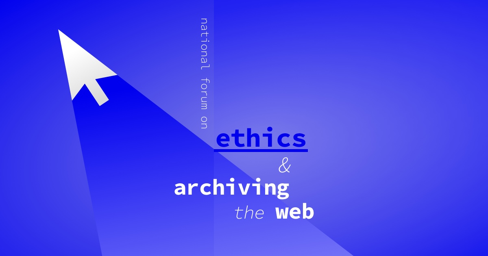

<iframe width="560" height="315" src="https://www.youtube.com/embed/yX2RrfNPQjg" frameborder="0" allow="accelerometer; autoplay; encrypted-media; gyroscope; picture-in-picture" allowfullscreen></iframe>
 

## Quick Start
1. Login to your user account. Enter a URL in the box in the center of the screen labeled ‘URL to capture’.
2. Press the ‘Start Capture’ button (look down and to the right of the box where you entered the URL).
3. Interact with the web page that loads so Webrecorder can capture the content displayed on this page. To collect audio or video from a page be sure to press ‘play’ so the file will load into the browser.
4. Continue to visit and browse the pages you would like to capture. Each page you view will be included in your capture [session](#session). Note: you will be capturing the contents of each page you visit but will not automatically obtain pages that are linked to on the pages you collect (hyperlinks).
5. To end your capture session hover over the ‘Capture’ button in the upper left corner of the screen so it changes to read ‘Stop’ then click that button.
6. Your [capture](#capture) will then be browsable. Note: the capture will not ‘replay’ like a linear recording but instead be an interactive copy of the pages you have collected.
7. This session will be saved to your account automatically. 

## Browse (access/review collection)
1. Select the collection you want to browse.
2. Click on the URL in the collection you want to view.
3. You can navigate within your collection by clicking on the links in the [collection navigator](#collection-navigator) panel on the left side of the screen to view each page you captured one by one. If you collected pages that link to each other you can use hyperlinks between those pages to move from one page to the next.

## Basic Collection Building
1. Plan what you want to capture in a collection. Note: adding or deleting from a collection can only occur by deleting a session - you cannot delete or modify individual pages in your collection.
2. Log in to your account and start a collection by clicking on the ‘+ New Collection’ button (on the left side of the screen below the section labeled 'New Capture') and enter a name for your collection. Note: at this point you can decide to make the collection visible to other people (public); at any time you can decide to make a collection ‘public’ (shared) or ‘private’ (only visible to you).
3. Start a collecting session by clicking on the button labeled ‘+ New Session’ and entering a URL for a page you want to add to your collection.
4. Press the ‘Start Capture’ button (below and to the right of the box where you entered the URL).
5. Interact with the web page that loads so Webrecorder can capture the content displayed on this page. To collect audio or video from a page, be sure to press ‘play’ so the file will load into the browser.
6. Continue to browse the pages you would like to capture. Each page you visit will be included in your capture session. Note: you will be capturing the contents of each page you visit but will not automatically obtain pages that are linked to on the pages you collect (hyperlinks).
7. To end your capture session hover over the ‘Capture’ button in the upper left corner of the screen so it changes to read ‘Stop’ then click that button.
8. Your collection will then be browsable. Note: the capture will not ‘replay’ like a linear recording but instead be an interactive copy of the pages you have collected.
9. Build your collection with additional sessions by repeating the steps above. Again, please note: adding or deleting from a collection can only occur by deleting a session - you cannot delete or modify individual pages in your collection.

## Basic List Building
1. Open your collection in the 'Collection Manager' view. See the panel on left side of the screen and click ‘EDIT’ or ‘+’ (located to the right of ‘LISTS’).
2. Enter a name for the [list](#lists) then click on the ‘+’. You can make as many lists as you like. When you have finished creating one or more list, click ‘Done’.
3. To add a page to a list you can simply drag a page over to the list in the collection navigator. Note: this will not remove the page from the main collection page (any page can be in as many lists as you’d like).
4. To view pages in a list, click on the list name in the collection navigator (panel on left side of the screen).
5. You can reorder pages in a list by dragging them up or down.
6. You can delete pages from a list by clicking on the trash can icon. Note: deleting a page from a list will not remove the page from the collection as a whole.
7. You can delete lists by clicking 'EDIT' to the right to 'LISTS' in collection navigator then clicking on the trashcan icon to the left of the name of the list you would like to delete.

## Making a Patch (adding to already collected data)
1. If there is missing content when you review a capture you will see a message indicating the resource cannot be found. You can often go back to the original page (or a copy in an open web archive) to [patch](#patch) this missing data into the page in your collection.
2. To start a patching session, click on the button labeled ‘Try to patch’.
3. Once you start a patch session, the targeted page will load and Webrecorder will try to retrieve the missing content from the live web, or from a public web archive if you have specified one.
4. To end your patching session hover over the ‘Patching’ button in the upper left corner of the screen so it changes to read ‘Stop’ then click that button.
5. When you end the patch session, Webrecorder will save this additional data to your collection.
6. If the patch session is successful when you browse the archived page in your collection the previously missing content will be present.

## Adding to a Collection and Deleting Sessions
1. Adding or deleting from a collection happens on the basis of a capture session. You cannot delete or modify individual pages or resources in your collection.
2. You can add to a collection by: initializing a new collecting session; starting a patch session (to fill in missing content on a previously collected page); or by uploading a [WARC](#warc) or ARC file.
3. To delete a session from your collection, select the menu button with 3 dots in it (on the left side of the screen) and then select ‘Manage Sessions’ from the dropdown menu.
4. On the sessions management page, click on the session you would like to delete. In the expanded view of the session review the information about the pages you captured in this session to make sure this is the session you want to permanently delete.
5. Click the button labeled 'Delete'.
6. Another path to delete a session is to click the session id via the [inspector panel](#inspector-panel) (in the lower left panel on your screen) or the session id column in the pages list. This session id will take you to the sessions management page where you can follow the directions above.

## Managing Collection Privacy
1. Collections are private by default. You can make a collection public via the privacy settings. Use the button under the title of the collection to make your collection public (you can make your collection private, again, at any time using this button as well). A public collection can be viewed by anyone and a private collection can only be seen by you when you are logged into your account.
2. To preview what your collection [cover page](#cover-page) will look like if you set your collection to ‘public’, you can click the button labeled ‘Cover’.

## Managing List Privacy
1. Lists are private by default. You can make a list public via the privacy settings if your collection is set to ‘public’. A public list can be viewed by anyone.
2. To make a list public click on grey circle next to the list name (in the collection navigator on the left side of the screen) so it turns to green. To make a list private, again, click on this circle, again, and it will turn back to grey and the list will no longer be visible to anyone other than you when you are logged in to your account.

## Exporting a Collection
1. As a logged in user, you can download your collection as a WARC file by clicking on the menu button with 3 dots in it (on the left side of the screen, to the right of the button labeled 'New Session') and then select ‘Download Collection’ from the dropdown menu.
2. To open a WARC file and view it offline, you can use [**Webrecorder Player**](https://github.com/webrecorder/webrecorderplayer-electron/), a free, open source software that can be [downloaded from GitHub](https://github.com/webrecorder/webrecorderplayer-electron/).

  

-----------------------------------------------------

 

## Glossary

**Capture (record)** - acquiring (collecting) web pages including all features, content and elements (i.e. HTML, CSS, interactive features, JavaScript, Flash, embedded media, etc)

**Collection** - A named grouping of one or more page(s), which can include lists

**Collection Navigator** - panel on the left side of the screen through which you can see, edit or delete lists in a collection

**Cover Page** -  the front page for a collection

**Inspector Panel** - box in the lower left hand corner of the screen that displays metadata about a page, such as time of capture and session ID

**Lists** - a grouping of one or more pages within a collection

**Native browser** - the web browser through which you are accessing the web (and Webrecorder). By default Webrecorder works through the native browser you are using to view web pages but you can choose to instead use a different preconfigured (remote) browser by selecting one from the list in the menu to the left of the box where you enter a URL when you begin a collecting session

**Network traffic** - communications traveling over a network (e.g. requests and responses between a web browser and server)

**Page** - web page, which is identified by a URL (sometimes more than one URL is associated with a page but this is not assumed in defining this unit); a page is a foundational unit and can include HTML, CSS, JavaScript, Flash, embedded media, etc

**Patch** (session) - insertion of missing resources are added to page(s) in a collection

**Preconfigured (remote) browser** - a version of a web browser that is self contained and fixed with the default settings assigned to it (preconfigured). A preconfigured browser can be used to capture elements of web pages that might not be able to be rendered by web browsers in the future, such as Flash. To use a preconfigured (remote) browser, select one from the list in the box below the box where you enter a URL capture when you begin a collecting session

**Private** - collection or list that is only visible to the owner/creator of the collection when they are logged in to their account

**Public** - collection or list that is shared and discoverable by sharing a link or via a user’s account page

**Reconstruction** - reassembly of resources (i.e. HTML, JavaScript, embedded media) to recreate a captured page

**Render** - to communicate and reassemble resources to make a archived page browsable

**Session** - period in which web content is captured; sessions are a defining unit for captures (sessions can be deleted but pages or resources within a session cannot be deleted)

**WARC** - An ISO standard file format for saving web archives

  

-----------------------------------------------------

 

### *Contributing to this Guide*

*Have any requests, suggested edits or topics you would like add to this guide?*

*The guide is available on GitHub at [webrecorder-user-guide](https://github.com/webrecorder/webrecorder-user-guide) and you can open an [issue](https://github.com/webrecorder/webrecorder-user-guide/issues) to make a suggestion. Contributions via pull requests are also welcome. You can also write to us directly at support@webrecorder.io with any feedback.*

  

-----------------------------------------------------

 

  
## *The National Forum on Ethics & Archiving the Web*

[The National Forum on Ethics & Archiving the Web](https://eaw.rhizome.org/) was a three-day conference that brought together activists, librarians, journalists, archivists, scholars, developers, and designers to talk about how to create richer, non-oppressive web archives that will better serve their publics and the historical record.

You can view footage from the 2018 conference at [https://livestream.com/newmuseum](https://livestream.com/newmuseum).

*The National Forum on Ethics & Archiving the Web was organized by [Rhizome](http://rhizome.org/) and hosted at the [New Museum](https://www.newmuseum.org/) in collaboration with the University of California at Riverside Library (UCR), the Maryland Institute for Technology in the Humanities (MITH), and the [Documenting the Now](http://docnow.io/) project (DocNow).*

*This event was made possible by the Institute of Museum and Library Services and the John S. and James L. Knight Foundation.*
