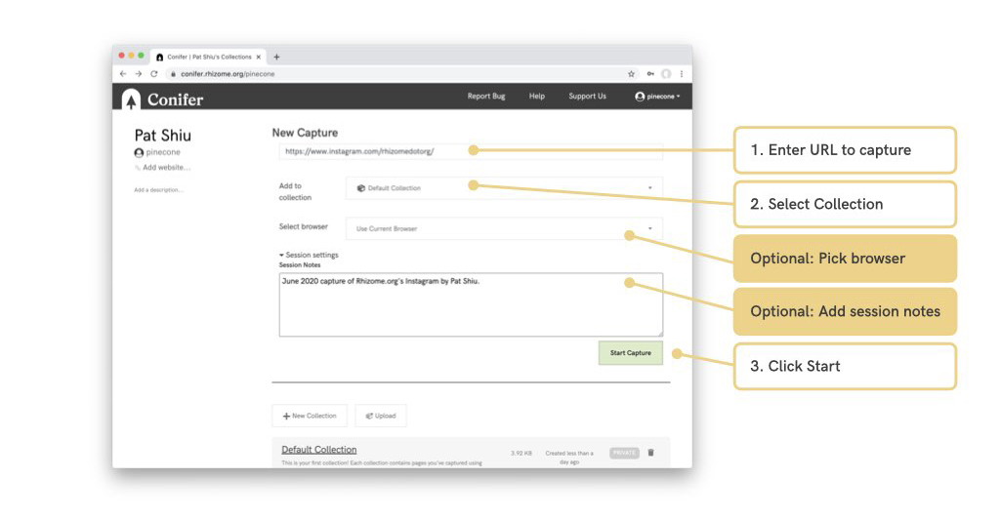
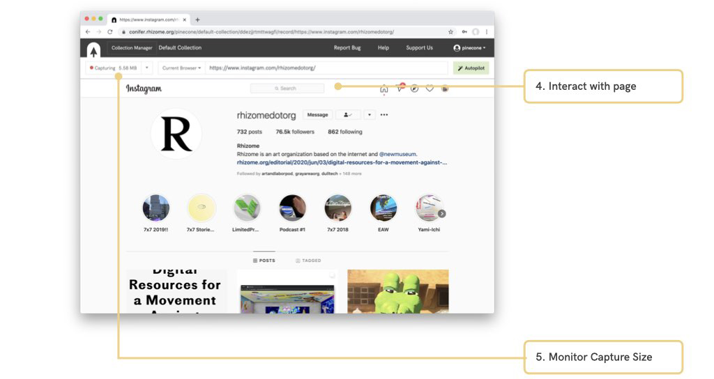
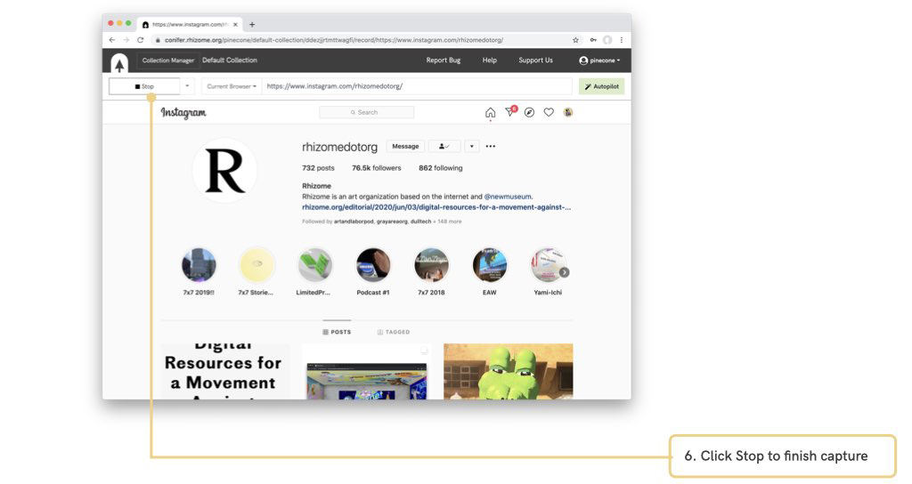
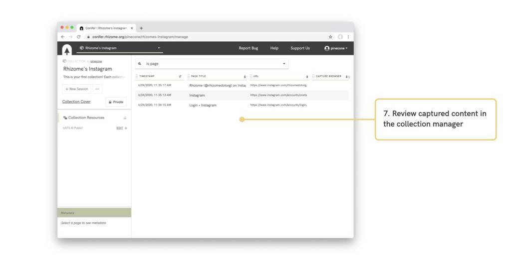

# Conifer User Guide
{: .fs-9 }

Welcome to the user guide for [Conifer](https://conifer.rhizome.org/) web archiving service hosted by [Rhizome](https://rhizome.org/).
{: .fs-6 .fw-300 }

This user guide welcomes community contributions and feedback, learn more [here](https://github.com/Rhizome-Conifer/conifer-user-guide).

---

# Quick Start: Capture a Webpage

---

#### Current and Past Contributors to the Conifer User Guide

<ul class="list-style-none">

  <li class="d-inline-block mr-1">
     
  </li>

</ul>
